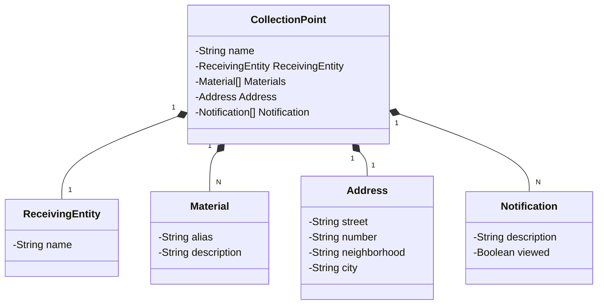

# EcoDispose API for find collection points for environmentally sensitive materials. 
Be ecologically sustainable!.

The EcoDispose API is a web and mobile backend solution for an application that supports community members who want to dispose of environmentally sensitive products sustainably and correctly.

It manages records of collection points, materials, notifications, and receiving entities, and demonstrates how to configure and run the application and database on the Railway cloud platform. Build updates and deployments are automated with the platform’s integration with GitHub.

For example, when the repository receives updates, the cloud service automatically generates a new build based on the configuration and can run the application automatically.


This project is an API built using **Java, Java Spring Boot, Postgres. **
Database and application service uses Railway cloud platform.

- Java 17
- Spring Boot 3 
- H2 (local) 
- PostgreSQL (production) 
- Railway 
- OpenAPI (Swagger) 
- CI/CD direct from GitHub 

## Table of Contents

- [Installation](#installation)
- [Configuration](#configuration)
- [Local Usage](#local-usage)
- [Cloud Usage](#cloud-usage)
- [Class Diagram](#class-diagram)
- [API Endpoints](#api-endpoints)
- [Contributing](#contributing)
- [Screenshots](#screenshots)

## Installation

1. Clone the repository:

```bash
git clone https://github.com/jonasfschuh/EcoDisposeAPI.git
```

2. Install dependencies with Maven

## Local-usage

1. Start the application with Maven
2. The API will be accessible at http://localhost:8080/swagger-ui/index.html
3. The H2 Database will be accessible at http://localhost:8080/h2-console
with H2 Database credentials: user: admin password: admin 

## Cloud-usage

1. Create a railway account https://railway.app/, and
2. Create a Postgres database.
3. Set the environment variables of API on IntelliJ as generated by the Postgres container on railway.
4. Logged into railway, configure the integration with github to generate continuous integration and delivery.
5. Create a service in railway. When deploying, the application will build and start the application automatically.

Notes: This service allows you to configure a domain to expose this service and make it accessible outside the container.

6. Below is an example generated in my configuration to access swagger-ui.

Interface for testing with swagger-ui - on railway cloud
https://ecodispose-api.railway.app/swagger-ui/index.html

## Class-diagram

Class generated in the mermaid pattern https://mermaid.js.org/intro/



Example POST data

```
{
  "name": "BestBuy - California",
  "receivingEntity": {
    "name": "Best Buy West La (Store 109)"
  },
  "address": {
    "street": "11301 W Pico Blvd",
    "neighborhood": "Sawtelle 90064",
    "city": "Los Angeles, CA "
  },
  "material": [
    {
      "alias": "battery",
      "description": "Accepts cell phone battery, batteries, car battery"
    }
  ],
  "notification": [
    {
      "description": "BestBuy promotion: for every 10 kilos of discarded batteries, you receive a $10 voucher to spend in the store",
      "viewed": true
    }
  ]
}


{
  "name": "BestBuy - Alaska",
  "receivingEntity": {
    "name": "Best Buy North Anchorage (Tikahtnu Commons) (Store 1760)"
  },
  "address": {
    "street": "1200 N Muldoon Rd",
    "neighborhood": "Ste G TIkahtnu Commons 99504",
    "city": "Anchorage, AK"
  },
  "material": [
    {
      "alias": "battery",
      "description": "Accepts cell phone battery, batteries, car battery"
    }
  ],
  "notification": [
    {
      "description": "BestBuy promotion: for every 10 kilos of discarded batteries, you receive a $10 voucher to spend in the store",
      "viewed": true
    }
  ]
}

```


## API Endpoints

The API provides the following endpoints:


## Contributing

Contributions are welcome! If you find any issues or have suggestions for improvements, please open an issue or submit a pull request to the repository.

When contributing to this project, please follow the existing code style, [commit conventions](https://www.conventionalcommits.org/en/v1.0.0/), and submit your changes in a separate branch.

## Screenshots

Railway dashboard with CI/CD from github.

Every time a push is made to the main branch of the repository, the application is compiled and deployed automatically.
 

Log details


Postgres running on railway


Public network to access application. 


Retrieve a list of all registered collection points example


